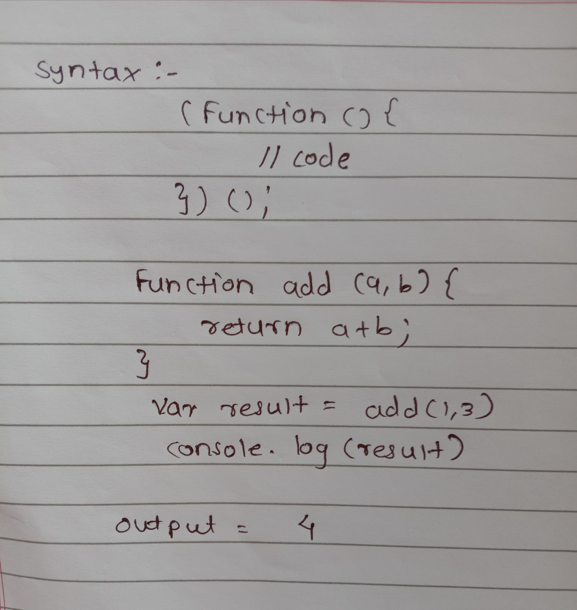

<br>
<br>


<div style="text-align: center"> 

# **JavaScript**
</div>

<br>

<div style="text-align: justify"> 

<font size="4">
<u>

 ## **History of Javascript:** 

</u>
In 1995, There was a couple of guys started a company called Netscape Navigator. It was the first browser in the market. At that time two windows are used in the market are Microsoft and Apple. Any company that uses the Operating System of Microsoft they have to pay a lot of money to them. But with the Netscape Browser, anyone can build the website on their own, and then they won't have to pay money to Microsoft and Apple. Then many companies use it to develop the own website. This was noticed by Microsoft that Netscape is becoming a very big company. So that they wanted to buy it but it was denied. Then the Microsoft stored the IP of the Netscape and create A browser call Internet Explorer and gave it for free. Because of this, the market for Netscape Navigator goes down. At that time there is a market leader in the backend language which Sun Microsystem, who invented the Java language.Java language is a very powerful and stable language in the backend. But the java was missing the frontend part. It tried to do the frontend part but it failed. So Netscape Navigator and Sun Microsystem came together and they wanted to fight Microsoft. Then Microsoft creates its own script call VB-Script. There is a developer called Brandan Eich who was given a task to create a new language and has the time of three weeks to create a new programming language. He again did some research and create a language called Mocha. But he has less time. So, there were many architectural flaws and mistakes in language. After that to make a proper name to language and for popularity Netscape, LiveScript and Mocha change their name to Javascript. In 1996, Google started search Engines so they started using Javascript. In 2000-2003 all the big companies came one is Yahoo and Google and their main business is to create websites. So they heavily contributing to JavaScript Community & JavaScript Standards. In 2004 Ajax came which was the 1st Gmail. ES3 and ES4 took around 8 years to develop. To avoid confusion in ES3.1 rename to ES5 In 2009. Back then Google was building their own browser called Chrome. Again Microsoft Realising that it is losing a market share. So, they started a new browser call Aged which was completely based on JavaScript. So in 2009 ES5 was finalized that all of the browsers started implementing ES5. If we work to build your web application using ES5 it will work across all browsers. In 2013 company noticed some drawbacks of Javascript that drawbacks are overcome in 2015 that is called ES6. Then after ES7, ES8, ES9, ES10 arrived.


<br>
<br>
<u>

## **Control Structure:**

</u>

<br>

| Sr No.  | Statement    | Description                      |
| :------: | :----------: | :--------------------            |
| 1       |if else       | use this statement to execute some code if the condition is true and another code if the condition is false                               |
| 2       | Switch case  | use this statement to select one of many blocks of code to be executed                        |
| 3       | while        | loops through a block of code as long as a specified condition is true.                        |
| 4       | do while     | This loop will execute the code block once, before checking if the condition is true, then it will repeat the loop as long as the condition is true.                                 |

<br>
</div>

<u>

## **Operators:**

</u>
<br>

### **Arithmetic Operator:**


<br>


| Sr No.| Operator | Description            |
| :-----:| :--------:| :-----------    |
|  1    |    +     | Add two Operands                |
|  2    |    -     | Substracr Two operands                |
|  3    |    *     | Multiply two Operands               |
|  4    |    /     | Divide two Operands           |
|  5    |    %     | Give the reminder               |
|  6    |    ++    | Increment value            |
|  7    |    --    | Decerement value    


<br>

### **Assignment Operator:**
<br>

| Sr No.| Operator | Description                  |
| :-----:| :--------:| :-----------                 |
|  1    |    =     | Assign the value             |
|  2    |    +=    | Add and Assign the value For example, x+=y is the same as x=x+y.       |
|  3    |    -=    | Substract and Assign the value For example, x-=y is the same as x=x-y.       |
|  4    |    *=    | Multiply and Assign the value For example, x*=y is the same as x=x*y.          |
|  5    |    /=    | Divide and Assign  the value For example, x/=y is the same as x=x/y.            |
|  6    |    %=    | Modulus and assign the value For example, x%=y is the same as x=x%y              |


<br>

### **Comparison Operators:**
<br>

| Sr No.| Operator | Description                  |
| :-----:| :--------:| :-----------               |
|  1    |    ==     | Returns true if the operands are equal             |
|  2    |    !=    | Returns true if the operands are not equal..       |
|  3    |    >    | Returns true if the left operand is greater than the right operand.       |
|  4    |    <    | Returns true if the left operand is less than the right operand.          |
|  5    |    >=    | Returns true if the left operand is greater than or equal to the right operand..            |
|  6    |    <=    | Returns true if the left operand is less than or equal to the right operand.              |
|  7    |    ===    | Returns true if the operands are equal and of the same type.              |

<br>

### **Bitwise Operators:**
<br>

| Sr No.| Operator | Description                  |
| :-----:| :--------:| :-----------                 |
|  1    |    &     |Returns a one in each bit position for which the corresponding bits of both operands are ones.            |
|  2    |   \|     | Returns a zero in each bit position for which the corresponding bits of both operands are zeros.     |
|  3    |    ^    | Returns a zero in each bit position for which the corresponding bits are the same.       |


<br>

### **Ternary Operators:**
<br>

| Sr No.| Operator | Description                             |
| :-----:| :-------:| :-----------                           |
|  1    |    ?:    | Conditional Expression(If condition istrue ? then value X : otherwise value Y)                                         |

<br>

### **Logical Operators:**
<br>

| Sr No.| Operator | Description                  |
| :-----:| :--------:| :-----------                 |
|  1    |    &&     |  returns true if both operands are true; otherwise, returns false.             |
|  2    |    \|\|    | returns true if either one operand is true; if both are false, returns false..       |
|  3    |    !    | Returns false if its single operand that can be converted to true; otherwise, returns true.

<br>

<div style="text-align: justify"> 

<u>

## **JavaScript Variables:**

</u>

<br>

In Javascript, Variables are nothing but a container that holds the data or value. In Javascript, you declare a variable and directly run it. So, Javascript is a dynamic type variable. In Javascript, variables are defined using the 'var' keyword.

- Local Variable :
In JavaScript local variable is declared inside a block or function
and it is accessible within that block or function only.

- Global Variable :
In JavaScript global variable is accessible from anywhere i.e.
declare outside the function.

### **JavaScript Data Types:**
<br>

There are two types of data types:

**1. Primitive Data Type:**
    
We can not Modify it. Types are String, Number, Boolean, Null, Undefined, Symbol.

**2. Non-Primitive Data Type:**

 We can modify it.Types are Object and Array.

In javascript, everything is an object.
Var keyword used in ES5.There is some drawback with the var keyword. Var had a functional scope so it has a lot of issues. So, var can be redeclared again. So, In ES6 they try to solve the issues two more variables are declared 'const' and 'let'
<br>
<br>

### **Difference Between Var, Let and Const :**

<br>

|  var            | let          | const        |
| :------------- | :---------- | :----------- |
|  can be redeclared | As per ES6 standards let can not be redeclared   | As per ES6 standards const can not be redeclared    |
| can be reinitialized   | can not be reinitialized | const can't be reinitialized but non-primitive values can be updated |
| var is functional scope   |lexical Scope | lexical scope |
| ES5   |ES6 | ES6 |
| hoisted   |doesn't get hoisted | doesn't get hoisted |

<br>
<br>


Anything which is in (“ “) is always a string in JavaScript.


<br>
<br>
When you do multiply, division, subtraction, modulo in JavaScript it converts all the variables back to the number and then does the operation. But only in Arithmetic, it works reverse because originally ‘+’ is assign to concatenation.
In JavaScript, we can use to convert any value into a number by adding ‘+’ in front of a number.
- Eg.  Var val=(+”100”);

    100 +(+0.18)

    =100.18
 
- 100 + “0.18”

  =”100018”
 
In JavaScript false value is ’0’ and the true value is ‘1’. So, when we do an arithmetic operation it converts the Boolean value into a number.

<br>

 
 
In Javascript whenever we do the arithmetic operation JavaScript converts the ’null ’ value into ‘0’.
 
Whenever we add anything to undefined we always get a Not a Number i.e., NaN.

   
<br>

- Number – 0,NaN – falsy value –false

- String - “ ” – falsy value – false

- Undefined – falsy value – false

- Null – falsy value – false

- (0,NaN, “ ” , null, Undefined) – any other than this value always truthy value – True.

Example: 

1. boolean(" ") = false
2. boolean(0) = false
3. boolean(NaN)= false

So, when we used other than value it gives the true value.

1. boolean("hello") = true
2. boolean(1) = true

when we add any non-primitive value in JavaScript it converts it into the string and then add it. 

In javascript, if we add ' ! ' in front of any value. Javascript converts it into the boolean value. It converts true to false and false to true.

Any non-primitive in javascript is always a concatenation.

  

<br>

<u>

## **Array :**

</u>

An array is a container it can hold everything that is why it holds one is number, One is a null and Boolean value. Array and object can hold any data type. Array length is not the length of an array it is the ‘last index+1’. In JavaScript index is nothing but a key. Without a key, we can not assign the value.

<br>


<u>

## **Operation on Object:**

</u>

<br>


<u>

## **Lexical And Functional Scope:**

</u>

### **Lexical Scope:**

Lexical Scope is any block that is inside the functional Scope. Example: The SD card inside the camera. So, the SD card is the lexical Scope of the Camera And it can not come out of the camera. 
Lexical Scope means anything which starts with ‘ { ‘.

### **Functional Scope:**

Functional Scope means we can declare some variable again inside the function. It always starts with function. Whenever we run the JavaScript function and the variable defined inside the function is get hoisted at the top. In JavaScript entire application itself is a functional scope. Functional Scope is global and local.

**Example:**


<u>

## **Copy by Value And Copy by Reference:**

</u>

- ### **Copy by Value:**

    Primitive types values are copy by value.

    Example: Xerox copy of Assignment.If we make some updates to that assignment. It updates its own copy, not the original one that is called copy by value.

- ### **Copy by Reference:**

    It holds the reference of the object. It passing the copy, not a reference.Non -primitive values are copy by reference.

    Example: Google docs or Excel sheet. When we create google docs. We write the document. We share that document by adding an Email Id. When we add an Email Id and share it with others we do not share the document we share the link of the document. So, both can update a document. That is the copy by reference means passing reference to another person so both can update the same document.

<br>


<br>

<u>

## **Function In JavaScript:**

</u>

<br>

The main role of function is to do the task. In JavaScript specifically in ES5 function behaves the same as a variable. Behavior like container, hoisted data at a top, local and global scope, object, override, etc. In JavaScript, everything is an object. So, it can directly override existing data. If we declare a variable inside the function its scope remains inside the function and if we declare the same variable which is already outside & inside function then it overrides the outside variable which is the same as in the function.

Syntax:
 
```js
Function function_name()
{
     //code
}
```

A function can not go to the child function scope it goes to the parent functional scope.


In JavaScript functions are always referred as a First-Class-Citizen i.e., the function can do anything in JavaScript it acts like a class, created as a constructor, etc. function act as a child of object

Whenever we used non-primitive value in function its passes the reference. 


<br>

<u>

## **Function Assignment:**

</u>

In JavaScript, a function can be declared in two ways one is function declaration and function assignment

Whenever we write a function with a function name or function keyword is called function declaration and when we assign the function to a variable is called function assignment.

Syntax: 

```js
    Var varname= function()
    {
        //code
    }
```
<u>

## **Function As a Parameter:**

</u>

The function can also pass to a function as a parameter. A function is Non- primitive which means whenever we pass the function as a parameter to another function it does not pass the function it passes a reference to the function.

**Inline parameter:** 

When we pass the parameter directly to the function is an inline parameter and nobody can access that.

    Eg. completeTask(300,5,print);
        


```js

    function add(a,b)
    {
        const c=a+b;
        return c;
    }
    const d=add(2,4);
    console.log(d);

```

    Output: 6

<u>

## **Higher-Order Function:**

</u>

Any function which takes a function as a parameter and or returns the function from that function.

<u>

## **Pure Function:**

</u>


A pure function is a function in which, when we pass a value it will return the same value. It does not change the input value. The pure function operates only on the parameter given it does not modify the parameter.

<br>


<br>

<u>

## **Immediately Invoked Function Expression(IIFE):**

</u>

In IIFE we defined function and directly call it. In this, we directly call the function by using scope ‘()’.It is Self Executing Function(SEF) expression. This function can call only once.

<br>



<u>

## **Inline Function:**

</u>
In JavaScript as an inline parameter we can also pass the function as an inline parameter because a function is non-primitive.

Example:

```js 

(function(value)
{
    console.log(“Initialization”);
})();

```

    Output: Initialization

<u>

## **Arrow Function:** 

</u>

Arrow function is always function expression and function assignment can not be function declaration. It can't get hoisted. If we have only a single parameter then not need to put ‘()’.If the function not taking any value then we have to write parenthesis.

Example:
<br>


```js

var b=()=>{
    console.log("arrow");
}
b();

```
    Output: arrow


<br>

<u>

## **JavaScript Constructor And Prototype:**

</u>
Function in JavaScript can be converted into a prototype. The prototype is an implementation of a class structure. A constructor is a function that creates an instance of a class. When we use a new keyword it becomes the object constructor. ’this’ keyword refers to the object of the class. An object is a child of a prototype object.

<br>
<br>


<br>

<u>

## **Literal Notation:**

</u>

<br>


<br>

<u>

## **Built-In Constructor Methods :**

</u>

| Sr. No | Methods     | Description                              |
| :------:| :---------- | :-----------                           |
|  1 | 	Object()    | Object method is used to create an object   |
| 2   | Array()  | Array method is used to create Array object.   |
| 3  | Array()  | Function is first class citizen. They can do anything in JavaScript    |
| 4  | 	Boolean()   | It is legacy code if we pass false in this function it creates an object of the function.    |
| 5  | 	Number()    | It is also legacy purpose.    |
| 6 | 	String()     | It convert anything to string. Has method charAt(), length(),etc.|
| 7  | 	Math()     | It is used for mathematical operation. It has many build in methods to perform mathematical operation random(), floor(), max(), min(), etc.  |
| 8  | 	RegExp()    | It is defined using literal notation and using the object constructor.    |
| 9  | 	Date()    | It returns the date like month day, year. Build in method getDate(), getHours(), getMonth() etc.    |

<br>

<u>

## **Array, Object, And String Methods:**

</u>

<br>

In JS, an array is nothing but an index-based object.

### **Array Method :** 

<br>

| Sr. No | Methods     | Description                              |
| :------:| :---------- | :-----------                           |
|  1 | 	length()    | It returns length of the array.   |
|  2 | 	push()    | It adds the element at the end of an array.   |
|  3 | 	pop()    | It removes an item from the end of the array.   |
|  4 | 	unshift()    | Add item at the beginning of the array.   |
|  5 | 	shift()    | It removes value from the beginning of the array.   |
|  6 | 	concat()    | It concatenates the old array with the new array by printing a new array.   |
|  7 | 	forEach()    | It is used for looping the function.   |
|  8 | 	map()    | It is used for transforming the array   |
|  9 | 	filter()    | It filtered out values from the array. It removes and filters out the empty value in the array.   |
|  10 | 	indexOf()    | It gives the index of the element if the value is not present. It returns a ‘-1’   |
|  11 | 	includes()    | It is the same as an index but it returns the values as true or false.   |
|  12 | 	join()    | It converts an array into a string.   |
|  13 | 	sort()    | It is used for sorting the array.   |
|  14 | 	slice()    | It is used to slice out the piece of an array.   |

<br>

### **Object Methods:**

<br>

| Sr. No | Methods     | Description                              |
| :------:| :---------- | :-----------                           |
|  1 | 	keys()    | keys method is used to return an array whose elements are string.   |
|  2 | 	freeze()    | It is used to freeze the object. It will not change it. It created static data.   |
|  3 | 	assign()    | It creates a new object and assigns it to the new object.   |
|  4 | 	toString()    | It convert object into the string.   |
|  5 | 	isArray()    | it is used to identify the object is an array or not. It returns a true or false value.   |

<br>

### **String Methods :**

<br>

| Sr. No | Methods     | Description                              |
| :------:| :---------- | :-----------                           |
|  1 | 	toUpperCase()    | It converts the string into Uppercase.   |
|  2 | 	toLowerCase()    | It converts the string into Lowercase.   |
|  3 | 	split()    | split the given string.   |
|  4 | 	replace()    | It replaces one string with another string.   |
|  5 | 	trim()    | It removes the space from the two edges/both sides.   |

<br>

In Js whenever we define the function inside an object is referred to as a method.

<br>


```js
let user{"id":123,"index":10,"age":23}

"getIndex":function()   //method
{    
    return user.index;
}

```
    output : 10
<br>

<u>

## **Built-In Functions In JavaScript:**

</u>

<br>

| Sr. No | Methods     | Description                              |
| :------:| :---------- | :-----------                           |
|  1 | 	setTimeOut()    | This function help us to delay the code execution. It runs only once.   |
|  2 | 	setInterval()   | It work as setTimeOut() but only difference is it run continuously. It like a timer loop.   |
|  3 | 	clearInterval()   | It removes the interval from code or we say stop the execution of interval.   |
|  4 | 	parseInt()   | It converts any number into an integer value.   |
|  5 | 	parseFloat()   | This function converts a string into a floating-point number.   |
|  6 | 	stringify()   | This function convert an object into a string.   |

</font>

</div>


